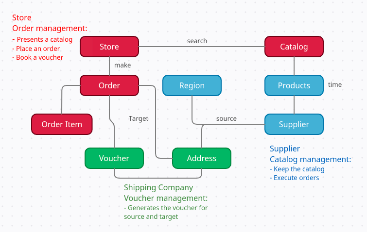

This is a proof of concept to demonstrate Spring Cloud and microservices. The goal is to build some microservices so that they are fully integrated, with guaranteed transactions and traceable.

# Business model

<h1 align="left">
  
</h1>

# About each module

## Store Flow Service Module

The store represents a florist, who knows all suppliers in each region or state. That is, after an online purchase in a specific region, the store will consult with suppliers in that region.

The source code is located in "store-ms".

## Supplier Flow Service Module

The supplier is responsible for receiving orders from the store and will inform you how long orders will be ready.

The source code is located in "supplier-ms".

# About the structure of the project

config-server 		- Config server microservice;

eureka-server 		- Eureka server microservice;

store-ms 			- Store microservices;

supplier-ms 		- Supplier microservices;

resources/images 	- General images of the project;

microservices-repo	- Repository for the configuration files and general properties of the microservices accessed by the server config microservice;

# How to build

```bash
mvn clean install
```

# How to run the services

Store service:

```bash
mvn spring-boot:run -f store-ms
```

Supplier service:

```bash
mvn spring-boot:run -f supplier-ms
```

Eureka server service:

```bash
mvn spring-boot:run -f eureka-server
```

Config server service:

```bash
mvn spring-boot:run -f config-server
```

# To do list

- [x] Build a store sample service
- [x] Build a supplier sample service
- [ ] Add tests for store service
- [ ] Add tests for supplier service
- [ ] Enable distributed tracing with spring sleuth